# GT-TD3 论文图集

本目录收录论文中的 Figure 1–13，用于 GitHub 项目说明、方法展示和结果回溯。

> Hanwen Miao, Haoran Hou, Zhaopeng Zhu, Zheng Chao, and Rui Zhang.<br>
> **GT-TD3: A Kinematics-Aware Graph-Transformer Framework for Stable Trajectory
> Tracking of High-Degree-of-Freedom (DOF) Manipulators.**<br>
> *Machines* 2026, 14(4), 397. [https://doi.org/10.3390/machines14040397](https://doi.org/10.3390/machines14040397)

原文为 CC BY 4.0 开放获取文章。图片从出版版 PDF 中按图区渲染，未改动图内数据、
图例或结论。当前代码使用发表后修订的 31 维 v2 状态；这些图对应论文中的原始
20 维实验，不应冒充为当前代码重新训练的结果。

## 方法与架构

<details open>
<summary><strong>Figure 1 - GT-TD3 Actor 整体架构</strong></summary>

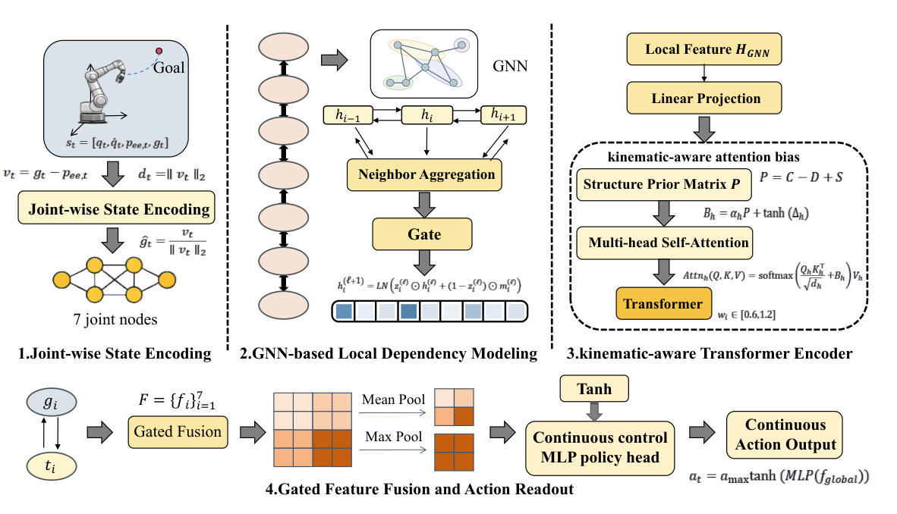

</details>

<details>
<summary><strong>Figure 2 - TD3 深度强化学习框架</strong></summary>

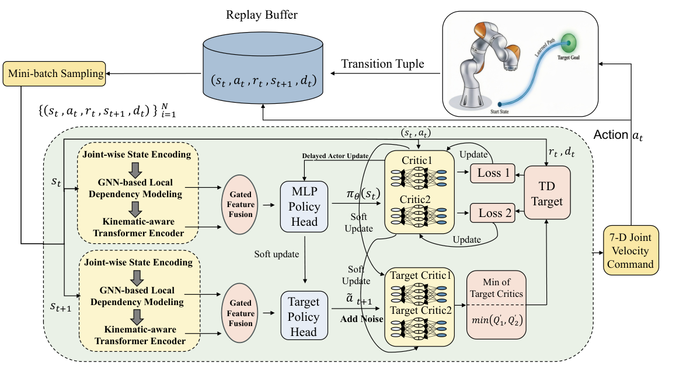

</details>

<details>
<summary><strong>Figure 3 - 双 Critic 网络</strong></summary>

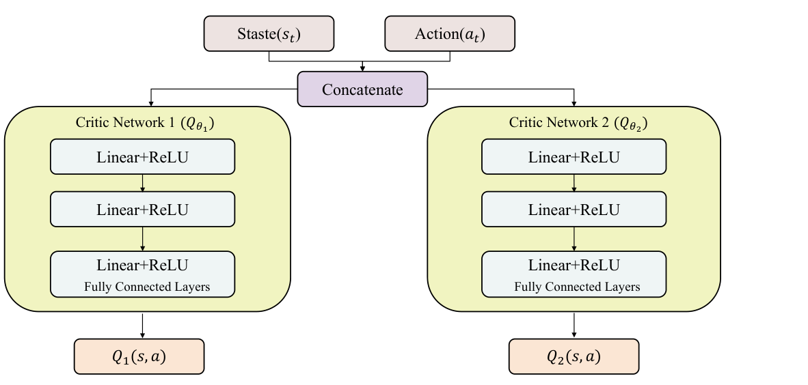

</details>

<details>
<summary><strong>Figure 4 - GNN 局部依赖建模模块</strong></summary>

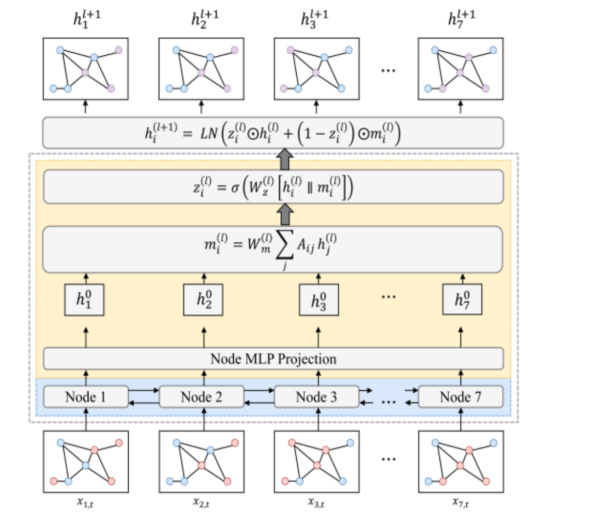

</details>

<details>
<summary><strong>Figure 5 - 运动学感知 Transformer Encoder</strong></summary>

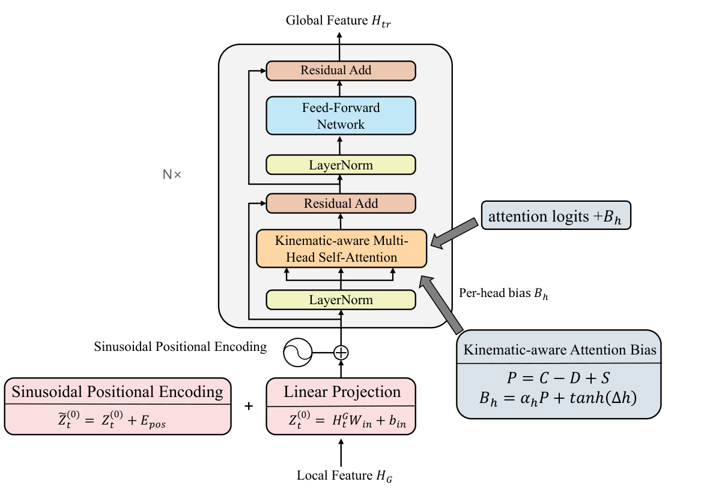

</details>

## 环境与实验结果

<details>
<summary><strong>Figure 6 - PyBullet KUKA iiwa 仿真环境</strong></summary>

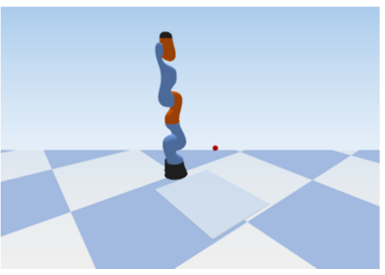

</details>

<details open>
<summary><strong>Figure 7 - 训练期间的任务层指标</strong></summary>

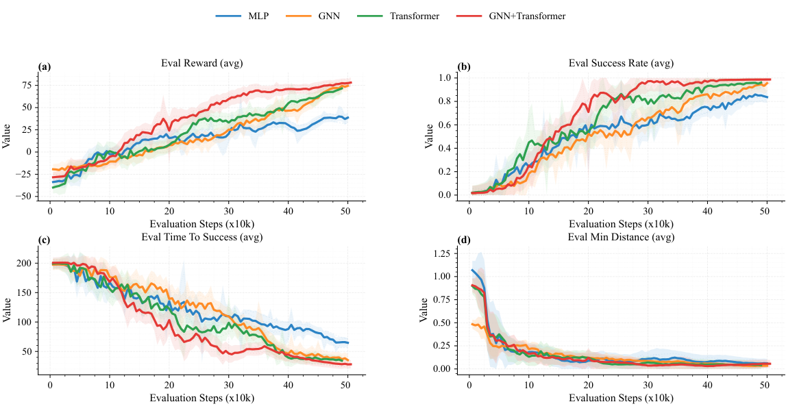

</details>

<details>
<summary><strong>Figure 8 - 训练期间的轨迹质量指标</strong></summary>

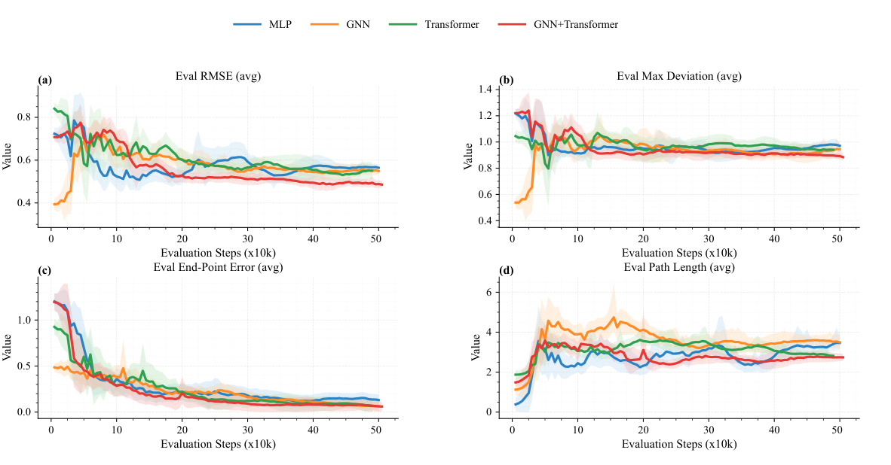

</details>

<details>
<summary><strong>Figure 9 - 测试阶段任务性能</strong></summary>

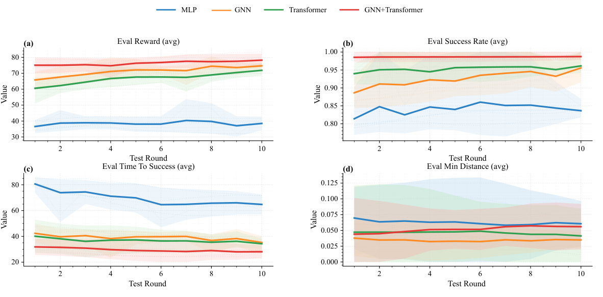

</details>

<details>
<summary><strong>Figure 10 - 测试阶段轨迹质量</strong></summary>

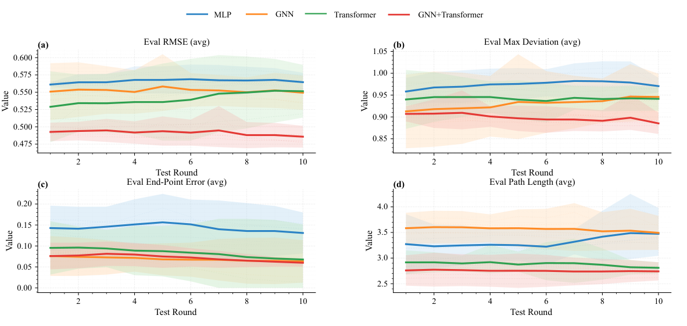

</details>

## 稳定性与轨迹

<details open>
<summary><strong>Figure 11 - 不同初始关节扰动下的稳定性</strong></summary>

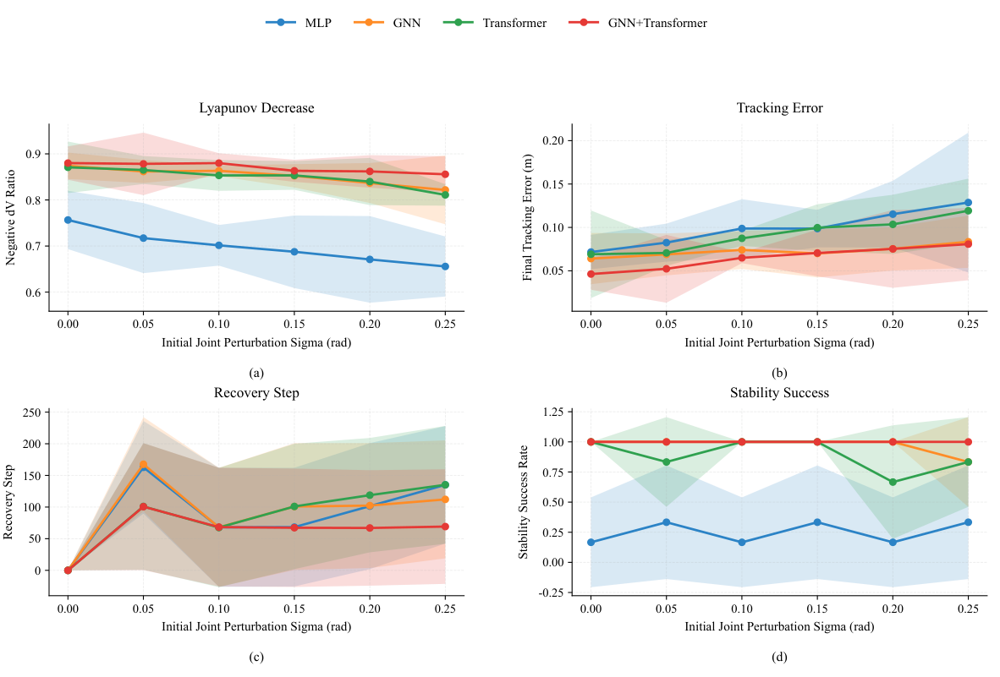

</details>

<details>
<summary><strong>Figure 12 - 最强扰动下的指标分布</strong></summary>

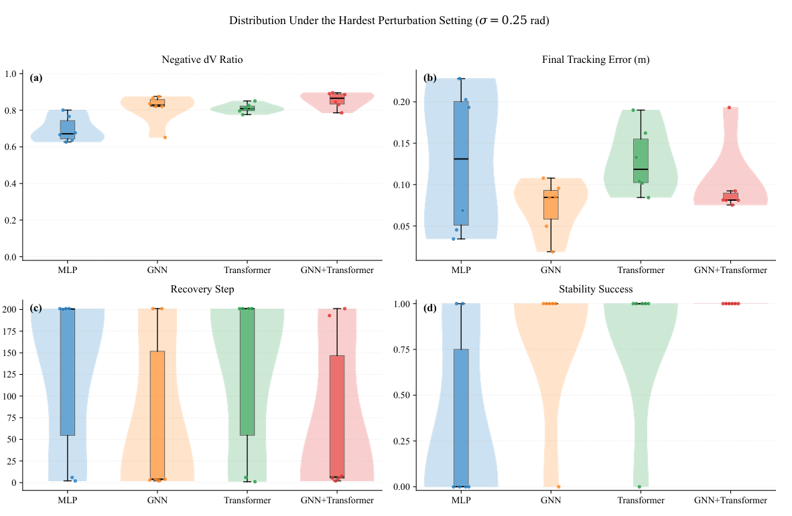

</details>

<details open>
<summary><strong>Figure 13 - 代表性三维末端轨迹</strong></summary>

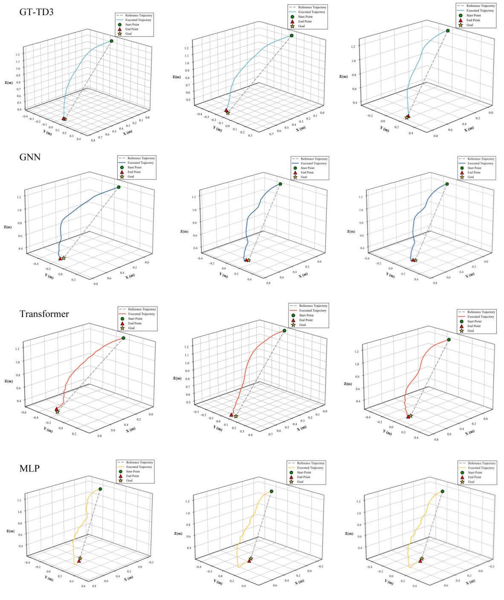

</details>

## 重新提取

若出版 PDF 版式未改变，可在项目根目录执行：

```powershell
python tools/extract_paper_figures.py "path/to/machines-14-00397-v2.pdf"
```

默认使用 3 倍渲染倍率输出到 `assets/paper/`。
